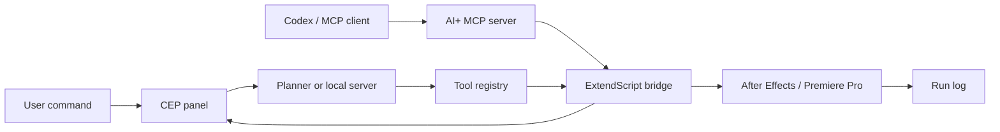

# AI+ Agent Architecture

AI+ is built around a small agent loop:



## Layers

`src/js/app.js`

Owns UI state, prompt input, planning, execution, logs, settings, and host refresh.

`src/js/agent.js`

Turns prompts into plans. It tries the optional provider first, then falls back to deterministic built-in planning.

`src/js/provider.js`

Stores the optional local planner endpoint and sends prompt/context/tool metadata to it.

`server.js`

Runs a localhost-only planner endpoint and Adobe job queue. It uses OpenAI when `OPENAI_API_KEY` and `AI_PLUS_MODEL` are set, then falls back to deterministic planning if the model call fails or is not configured.

`mcp-server.js`

Runs a stdio MCP server for Codex or other MCP clients. It can plan locally and can enqueue Adobe jobs on the local bridge.

`src/js/toolRegistry.js`

Defines every tool the AI is allowed to request. The registry includes host support and risk level so unsupported actions can be filtered before execution.

`src/js/cep.js`

Wraps `window.__adobe_cep__.evalScript` and provides browser-preview fallback behavior.

`host/jsx/ai-plus.jsx`

Executes actions inside Adobe apps. This is the only layer that touches After Effects or Premiere Pro project state.

## Plan Format

```json
{
  "title": "AI+ plan",
  "actions": [
    {
      "tool": "addTextLayer",
      "args": {
        "text": "AI+",
        "position": "center"
      },
      "reason": "Add editable title text."
    }
  ]
}
```

## Safety Model

- no unknown tools execute
- host-incompatible tools are filtered out
- After Effects write operations are wrapped in one undo group
- host responses are returned as JSON
- provider output is treated as untrusted input

## Extending The AI

Add a new capability in three places:

1. Register it in `src/js/toolRegistry.js`.
2. Teach the planner in `src/js/agent.js` when to use it, or return it from the provider endpoint.
3. Implement the host function in `host/jsx/ai-plus.jsx` and add it to `commandMap`.
