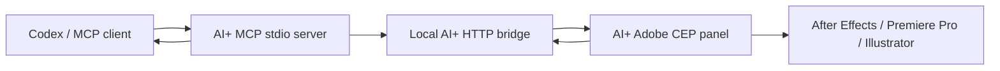

# Connecting Codex To AI+

AI+ includes a no-dependency MCP server so Codex can plan Adobe work and queue jobs for the open AI+ panel.

## 1. Start The Local Bridge

In this project:

```sh
npm run planner
```

This starts:

- `http://127.0.0.1:8787/plan`
- `http://127.0.0.1:8787/jobs`
- `http://127.0.0.1:8787/health`

When the AI+ panel provider is `Codex CLI`, the `/plan` endpoint shells out to the local `codex exec` command and then sanitizes the returned JSON plan against AI+'s tool registry. If the server process cannot find `codex`, start the bridge with:

```sh
AI_PLUS_CODEX_BIN=/Applications/Codex.app/Contents/Resources/codex npm run planner
```

## 2. Connect The Adobe Panel

Open the AI+ panel in After Effects, Premiere Pro, or Illustrator.

Set `Provider` to `Codex CLI` and keep the planning endpoint as:

```text
http://127.0.0.1:8787/plan
```

When this endpoint is set, the panel also watches the `/jobs` queue. Jobs queued by MCP are picked up by the panel and executed inside the Adobe host.

## 3. Register The MCP Server With Codex

From this project folder:

```sh
codex mcp add ai-plus -- node /Users/yuchan/Desktop/plugins/AI+/mcp-server.js
```

If your Codex environment uses a config file instead, point it at:

```json
{
  "mcpServers": {
    "ai-plus": {
      "command": "node",
      "args": ["/Users/yuchan/Desktop/plugins/AI+/mcp-server.js"],
      "env": {
        "AI_PLUS_SERVER_URL": "http://127.0.0.1:8787"
      }
    }
  }
}
```

## MCP Tools

`ai_plus_health`

Checks whether the MCP server can reach the local AI+ bridge.

`ai_plus_list_capabilities`

Lists the Adobe tools AI+ can plan with.

`ai_plus_plan`

Creates a gated plan without executing it in Adobe.

`ai_plus_enqueue_adobe_job`

Creates a plan and queues it on the local bridge for the AI+ Adobe panel to pick up.

`ai_plus_get_adobe_job`

Reads queued, running, completed, or failed job status.

## Runtime Shape



The MCP server does not directly mutate Adobe projects. It queues jobs. The Adobe panel executes them through the existing ExtendScript bridge, which keeps all host changes inside the Adobe undo/history model.
